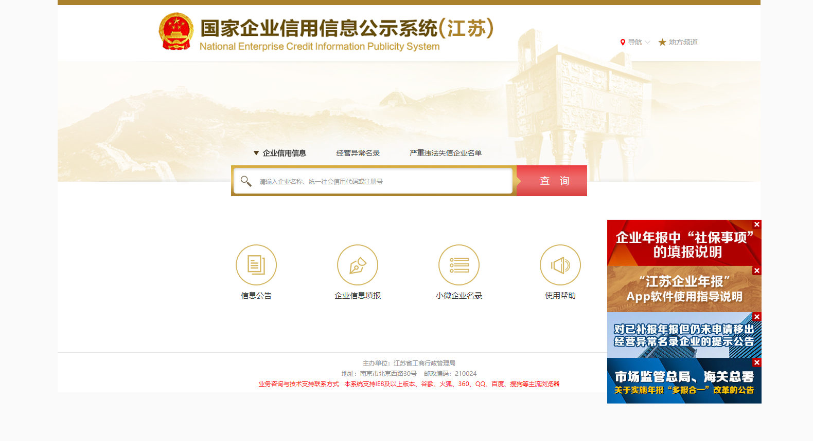
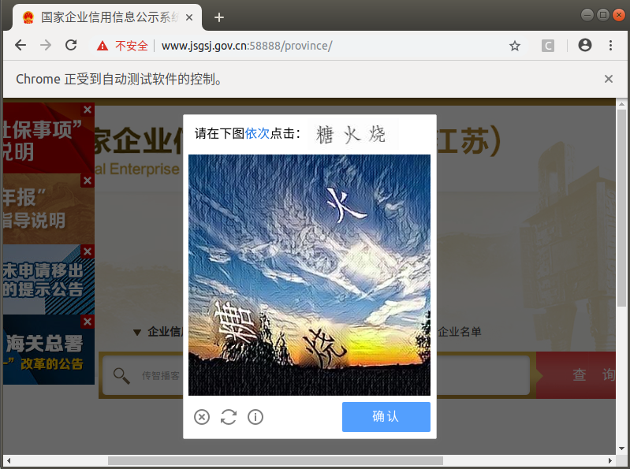
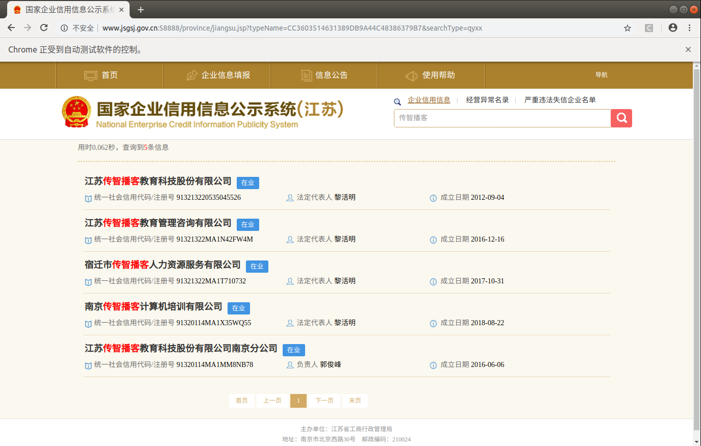
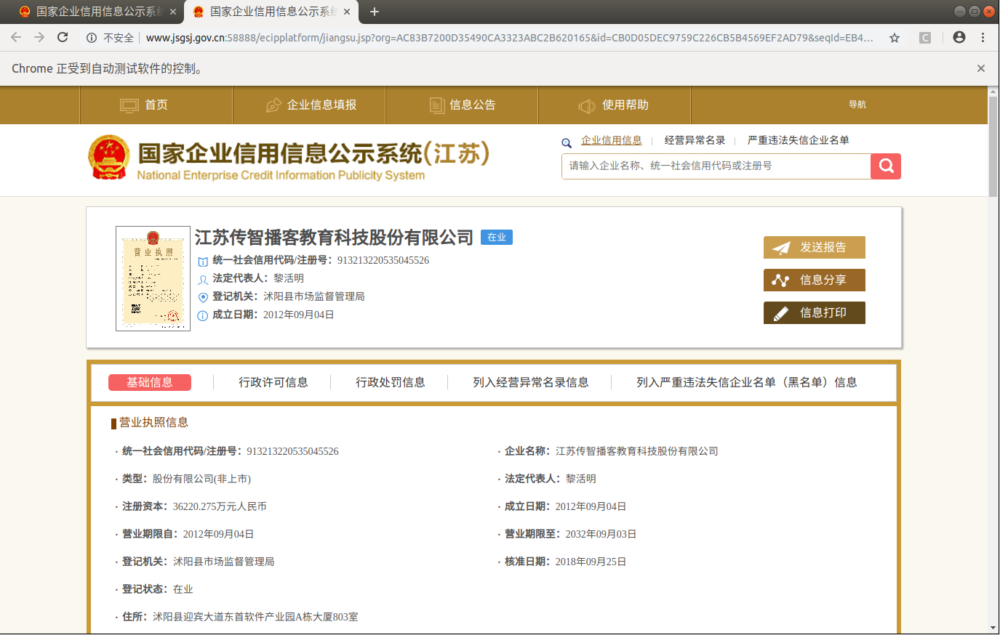
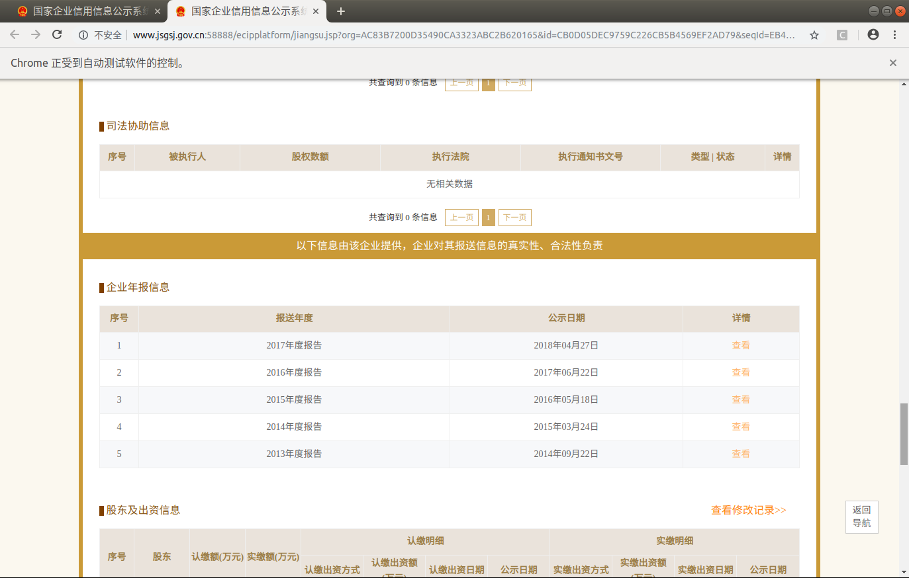

## 国家企业公示网项目分析
##### 学习目标：
1. 了解 获取数据的抓取流程
2. 了解 每个组件的功能
3. 了解 项目运行流程
_________________


> 演示运行效果，确定被抓取网站状态正常


### 1. 确定抓取流程，确定数据位置

> 使用selenium控制浏览器进行抓取

#### 1.1 网站首页



#### 1.2 行为验证图片

> 在输入企业名称点击查询后有可能会跳出验证图片，我们可以采取手动打码或使用第三方打码平台的方式来获取验证图片的点击坐标



#### 1.3 选择列表页中第一个公司



#### 1.4 确定数据位置



#### 1.5 保存数据页面

> 数据量庞大，可以先保存数据的各个页面到本地，后续再进行提取




### 2. 项目代码组件

> 基于数据抓取的流程，可以确定项目代码所需要的组件

- 消息中间件
- webapi
- node_server节点任务调度
- crawler爬虫

### 3. 消息中间件（消息总线）

> 使用redis作为消息总线

#### 3.1 token队列

- key：gsxt_token
- 功能：存储唯一识别码token，生产存储，等待被消费
- 数据结构：List
```
[token1, token2, ...]
```

#### 3.2 任务详情hashmap

- key：gsxt_task:token
- 功能：根据token存储各自抓取任务的详细信息，包含返回的数据
- 数据结构：Hashmap
```
{
	company_name, 
		str # 公司名称
	token, 
		str # 任务唯一识别码
	crack_captcha_mode, 
		str # 默认'0'(手动破解); '1'为调用打码平台破解
	status, 
		str # 'wait', 任务没开始
        str # 'crawling', 抓取中
    	str # 'failed', 失败
    	str # 'done', 完成
	msg, 
		str # status状态描述信息
	data, 
		json_str # 数据
	captcha_params,
		str # 图片验证码打码结果字符串
}
```


### 4. webapi

#### 4.1 功能

- 启动爬虫
- 手动打码
- 获取抓取结果

#### 4.2 设计接口

- 首页接口说明文档
- 爬虫启动接口
- 手动打码静态页面接口
- 手动打码获取验证码信息接口
- 获取任务状态或结果接口

#### 4.2.1 首页接口说明文档

```
GET /
```

#### 4.2.2 爬虫启动接口

```
GET /company
入参：
	company_name
	crack_captcha_mode
返回任务详情json_str：
	gsxt_task:token
```

#### 4.2.3 手动打码静态页面接口

```
GET /crack_captcha
入参：
	token
返回：
	手动打码的html页面
```

#### 4.2.4 手动打码获取验证码信息接口

```
POST /crack_captcha
入参：
	token
    captcha_params
返回任务详情json_str：
	gsxt_task:token
```

#### 4.2.5 获取任务状态或结果接口

```
GET /result
入参：
	token
返回任务详情json_str：
	gsxt_task:token
```

### 5. node_server节点任务调度

- 轮询gsxt_token队列，取出token
- 根据token从gsxt_task:token中读取任务信息
- 启动爬虫并传递参数

### 6. crawler爬虫

1. 根据入参抓取企业数据
2. 捕捉并记录异常的页面
3. 向gsxt_task:token中注册任务状态status和msg
4. 从gsxt_task:token中轮询读取打码结果captcha_params
5. 向gsxt_task:token返回数据data

### 7. 组件以及功能流程图


### 8. 项目运行流程

#### 8.1 接口启动爬虫

- 调用webapi启动爬虫/company接口生成token并向redis的gsxt_token队列中注册token，同时将任务详情字典写入gsxt_task:token

#### 8.2 节点调度启动爬虫
- node_server轮询gsxt_token队列，获取token，读取gsxt_task:token得到参数字典，启动crawler，并传入参数字典

#### 8.3 爬虫抓取

1. 初始化driver
2. 输入公司名称,并点击
3. 判断是否需要验证
4. 如果需要验证，获取验证图片并保存
5. 获取打码坐标
6. 点击验证图片
7. 判断查询结果
8. 选择第一条查询结果
9. 获取主要信息
10. 保存数据页面
11. 向redis中发送信息
12. 对失败情况进行保存,关闭driver,推送失败信息
13. 组织抓取逻辑，成功关闭driver

_________________

## 小结
1. 了解 获取数据的抓取流程
2. 了解 每个组件的功能
3. 了解 项目运行流程