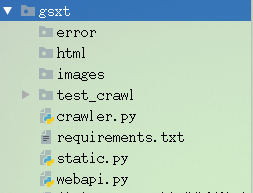

## crawler爬虫实现
##### 学习目标：
1. 了解 crawler爬虫运行流程
2. 了解 crawler爬虫模块实现

_________________

### 1. crawler功能

1. 初始化driver
2. 输入公司名称,并点击
3. 判断是否需要验证
4. 如果需要验证，获取验证图片并保存
5. 获取打码坐标
6. 点击验证图片
7. 判断查询结果
8. 选择第一条查询结果
9. 获取主要信息
10. 保存数据页面
11. 向redis中发送信息
12. 对失败情况进行保存,关闭driver,推送失败信息
13. 组织抓取逻辑，成功关闭driver

### 2. crawler代码实现

- 根据crawler的功能完成函数并组织运行逻辑

> /gsxt/crawler.py

```
......

class GsxtJSCrawler():
    """爬虫"""
    def __init__(self, task_dict={}):
        self.crack_captcha_mode = task_dict.get('crack_captcha_mode', '0') # 打码策略 '0'手动破解;'1'调用打码平台
        self.token = task_dict.get('token', None) # token
        self.company_name = task_dict.get('company_name', None) # 公司名称
        self.proxy = None # 代理ip
        # self.proxy = 'http://182.88.185.38:8123'

        self.headers = {'User-Agent': 'Mozilla/5.0 (Windows NT 10.0; Win64; x64) AppleWebKit/537.36 (KHTML, like Gecko) Chrome/67.0.3396.87 Safari/537.36'}
        self.url = 'http://www.jsgsj.gov.cn:58888/province/' # 目前只有江苏 重庆等少数地区的接口还算稳定
        # self.url = 'http://www.gsxt.gov.cn/index.html'
        self.captcha_img = None # driver中的图片对象

        self.redis_key = '{}:{}'.format(GSXT_TASK_TOPIC, self.token)

        self.item = {} # 数据


    def init_driver(self):
        """初始化driver"""
        if self.proxy:
            opation = webdriver.ChromeOptions()
            opation.add_argument('--proxy-server={}'.format(self.proxy))
            self.driver = webdriver.Chrome('/home/worker/Desktop/driver/chromedriver', chrome_options=opation)
        else:
            self.driver = webdriver.Chrome('/home/worker/Desktop/driver/chromedriver')
            # self.driver = webdriver.PhantomJS('/home/worker/Desktop/driver/phantomjs')
        self.driver.get(self.url)
        time.sleep(2)
        self.driver.set_window_size(800, 600)


    def send_company_name(self):
        """输入公司名称,并点击"""
        self.driver.find_element_by_xpath('//*[@id="name"]').send_keys(self.company_name)
        time.sleep(1)
        self.driver.find_element_by_xpath('//a[@class="bt-chaxun"]').click()


    def check_captcha_img(self):
        """判断是否需要验证"""
        i = 0
        while i < 3:
            try: # 手动显式等待验证码图片出现
                time.sleep(1)
                # 获取图片对象
                self.captcha_img = self.driver.find_element_by_xpath('//img[@class="geetest_item_img"]')
                return # self.captcha_img != None
            except:
                # 存在不需要验证的情况; 也存在滑动的情况
                # 对于滑动拼图就pass
                if self.driver.current_url != self.url:
                    return # self.captcha_img = None
            i += 1


    def get_captcha_img(self):
        """获取验证图片并保存"""
        captcha_img_url = self.captcha_img.get_attribute('src')
        img_resp = requests.get(captcha_img_url, headers=self.headers)
        img = img_resp.content
        print(img)
        with open('./images/{}.jpg'.format(self.token), 'wb') as f:
            f.write(img)
        """width:100%, height:112%
        使用PIL模块"""
        im = Image.open('./images/{}.jpg'.format(self.token))
        width, height = im.size
        im.thumbnail((width, height / 1.12))
        im.save('./images/{}.jpg'.format(self.token), 'JPEG')


    def get_captcha_offset(self):
        """获取打码坐标"""
        # 手动打码
        if self.crack_captcha_mode == '0':
            i = 0
            while i < 180:
                captcha_offset = redis.hget(self.redis_key, 'captcha_params')
                if captcha_offset is not None:
                    return captcha_offset
                time.sleep(1)
                i += 1
            return None # 超时,没有获取打码坐标

        # 调用第三方打码
        elif self.crack_captcha_mode == '1':
            """暂不实现"""
            return None

        else:
            raise TypeError('仅支持webapi+redis+crawler组件模式的手动或者第三方打码方式')


    def click_captcha_offset(self, captcha_offset_str):
        """点击验证坐标"""
        captcha_offset = []
        # captcha_offset_str = '247,202,142,150,'
        captcha_offset_list = captcha_offset_str.split(',')[:-1]  # ['247', '202', '142', '150']
        for x in captcha_offset_list[::2]:
            y = captcha_offset_str.split(',')[:-1][captcha_offset_str.split(',')[:-1].index(x) + 1]
            captcha_offset.append((x, y))
        # captcha_offset = [('247', '202'), ('142', '150')]
        # captcha_offset = [(x, captcha_offset_str.split(',')[:-1][captcha_offset_str.split(',')[:-1].index(x)+1])
        #                   for x in captcha_offset_str.split(',')[:-1][::2]]
        """点击破解"""
        for i in range(len(captcha_offset)):
            ActionChains(self.driver).move_to_element_with_offset(
                to_element=self.captcha_img,
                xoffset=int(captcha_offset[i][0]) - 0, # 保存的图片和页面上图片大小不一致!
                yoffset=int(captcha_offset[i][1]) - 0).perform()
            # 时间要随机
            time.sleep(1)
            time.sleep(random.random())
            ActionChains(self.driver).click().perform()
        input('注意!这里不光需要模拟真人操作的随机,而且从出现验证图片开始就检测鼠标点击和轨迹!哪怕使用打码平台也要加入无用的鼠标动作!')
        # 点击确认提交
        self.driver.find_element_by_xpath('//a[@class="geetest_commit"]').click()
        time.sleep(2)
        # 判断点击是否成功
        captcha_img = self.driver.find_elements_by_xpath('//img[@class="geetest_item_img"]')
        return False if captcha_img != [] else True # 如果还有验证图片就说明失败了


    def check_result(self):
        """判断查询结果"""
        time.sleep(2)
        rets = self.driver.find_elements_by_xpath('//div[@class="listbox"]')
        return False if rets == [] else True


    def choice_first_result(self):
        """选择第一条查询结果"""
        time.sleep(2)
        self.driver.find_element_by_xpath('//div[@class="listbox"]/a[1]').click()
        """有时会跳出新的标签页,所以根据句柄强行切换到最后一个标签页"""
        self.driver.switch_to.window(self.driver.window_handles[-1])


    def get_baseinfo_item(self):
        """获取主要信息
        """
        i = 0
        while i<5: # 手动显式等待,等待页面加载完毕,以reg_no是否出现为标志
            reg_no = self.driver.find_elements_by_xpath('//*[@id="REG_NO"]')
            if reg_no != []:
                break
            time.sleep(3)
            i += 1
        # 统一社会信用代码/注册号REG_NO
        reg_no = self.driver.find_elements_by_xpath('//*[@id="REG_NO"]')
        if reg_no == []:
            return False
        self.item['reg_no'] = reg_no[0].text if id != [] else ''
        # 企业名称CORP_NAME
        corp_name = self.driver.find_elements_by_xpath('//*[@id="CORP_NAME"]')
        self.item['corp_name'] = corp_name[0].text if id != [] else ''
        # 类型ZJ_ECON_KIND
        zj_econ_kind = self.driver.find_elements_by_xpath('//*[@id="ZJ_ECON_KIND"]')
        self.item['zj_econ_kind'] = zj_econ_kind[0].text if id != [] else ''
        # 法定代表人OPER_MAN_NAME
        oper_man_name = self.driver.find_elements_by_xpath('//*[@id="OPER_MAN_NAME"]')
        self.item['oper_man_name'] = oper_man_name[0].text if id != [] else ''
        # 注册资本REG_CAPI
        reg_cpi = self.driver.find_elements_by_xpath('//*[@id="REG_CAPI"]')
        self.item['reg_cpi'] = reg_cpi[0].text if id != [] else ''
        # 成立日期START_DATE
        start_date = self.driver.find_elements_by_xpath('//*[@id="START_DATE"]')
        self.item['oper_man_name'] = start_date[0].text if id != [] else ''
        # 营业期限自FARE_TERM_START
        fare_term_start = self.driver.find_elements_by_xpath('//*[@id="FARE_TERM_START"]')
        self.item['fare_term_start'] = fare_term_start[0].text if id != [] else ''
        # 营业期限至FARE_TERM_END
        fare_term_end = self.driver.find_elements_by_xpath('//*[@id="FARE_TERM_END"]')
        self.item['fare_term_end'] = fare_term_end[0].text if id != [] else ''
        # 登记机关BELONG_ORG
        belong_org = self.driver.find_elements_by_xpath('//*[@id="BELONG_ORG"]')
        self.item['belong_org'] = belong_org[0].text if id != [] else ''
        # 核准日期CHECK_DATE
        check_date = self.driver.find_elements_by_xpath('//*[@id="CHECK_DATE"]')
        self.item['check_date'] = check_date[0].text if id != [] else ''
        # 登记状态CORP_STATUS
        corp_status = self.driver.find_elements_by_xpath('//*[@id="CORP_STATUS"]')
        self.item['corp_status'] = corp_status[0].text if id != [] else ''
        # 住所ADDR
        addr = self.driver.find_elements_by_xpath('//*[@id="ADDR"]')
        self.item['addr'] = addr[0].text if id != [] else ''
        # 经营范围FARE_SCOPE
        fare_scope = self.driver.find_elements_by_xpath('//*[@id="FARE_SCOPE"]')
        self.item['fare_scope'] = fare_scope[0].text if id != [] else ''
        return True


    def save_html(self):
        """保存首页数据页面,后续可提取完整信息
        同样可以保存其他数据页
        """
        file_name = './html/{}_base.html'.format(self.item['reg_no'])
        with open(file_name, 'w') as f:
            f.write(self.driver.page_source)


    def save_fail(self, msg):
        """保存失败情况,关闭driver,推送失败信息"""
        # self.driver.save_screenshot('./error/{}.png'.format(self.token)) # 70版本的chrome不能调用截图功能
        print(msg)
        file_name = './error/{}_base.html'.format(self.token)
        with open(file_name, 'w') as f:
            f.write(self.driver.page_source)
        self.driver.quit() # 先保存失败,再关闭driver!
        self.send_msg_to_redis(msg=msg, status='failed')


    def send_msg_to_redis(self, msg, status):
        """向redis中发送信息"""
        redis.hset(self.redis_key, 'status', status)
        redis.hset(self.redis_key, 'msg', msg)


    def _main(self):
        """抓取逻辑"""
        if self.company_name is None:
            print('没有公司名称,查个毛线')
            return
        if self.token is None:
            print('想单文件抓取自己写啊!')
            return
        try: # 初始化driver
            self.init_driver()
        except:
            self.save_fail('初始化失败')
            return

        self.send_msg_to_redis(msg='抓取进行中', status='crawling')

        try: # 输入公司名称点击
            self.send_company_name()
        except:
            input(11)
            self.save_fail('输入公司名称点击失败')
            return

        self.check_captcha_img() # 检查是否需要验证
        if self.captcha_img is not None: # 需要验证的逻辑
            self.get_captcha_img() # 获取验证图片并保存
            captcha_offset_str = self.get_captcha_offset() # 获取打码结果
            print(captcha_offset_str)
            ret = self.click_captcha_offset(captcha_offset_str) # 点击验证坐标
            if not ret: # 验证点击失败
                self.save_fail('验证点击失败, 点对了也失败是因为同一ip访问次数过多, 请更换代理ip')
                return
        if not self.check_result(): # 判断 没有结果就结束
            self.save_fail('查询失败')
            return

        """仅对结果列表中第一个搞事情
        拿到所有html的page_source,并只返回主要信息
        提取数据的思路:提取一点就保存一点!
        """
        self.choice_first_result() # 选择结果列表中第一个
        try:
            self.get_baseinfo_item() # 主要信息
            print(self.item)
        except:
            self.save_fail('提取数据失败')

        self.save_html()  # 保存数据页面,后续可以提取完整信息
        # 先推数据,后推消息
        redis.hset(self.redis_key, 'data', self.item) # 向redis存数据
        self.send_msg_to_redis(msg='抓取成功', status='done')

        self.driver.quit() # 关闭浏览器
        # self.driver.service.process.pid # webdriver-server的pid


    def run(self):
        self._main()


if __name__ == '__main__':

    server = CrawlerServer()
    server.crawl()


```

### 3. 完成后的项目文件结构



### 4. 后续可以继续完善

- 抓取更多的字段
- 保存更多的数据页面
- 以token命名，记录详细的日志信息
- 对接第三方打码平台

_________________

## 小结
1. 了解 crawler爬虫运行流程
2. 了解 crawler爬虫模块实现