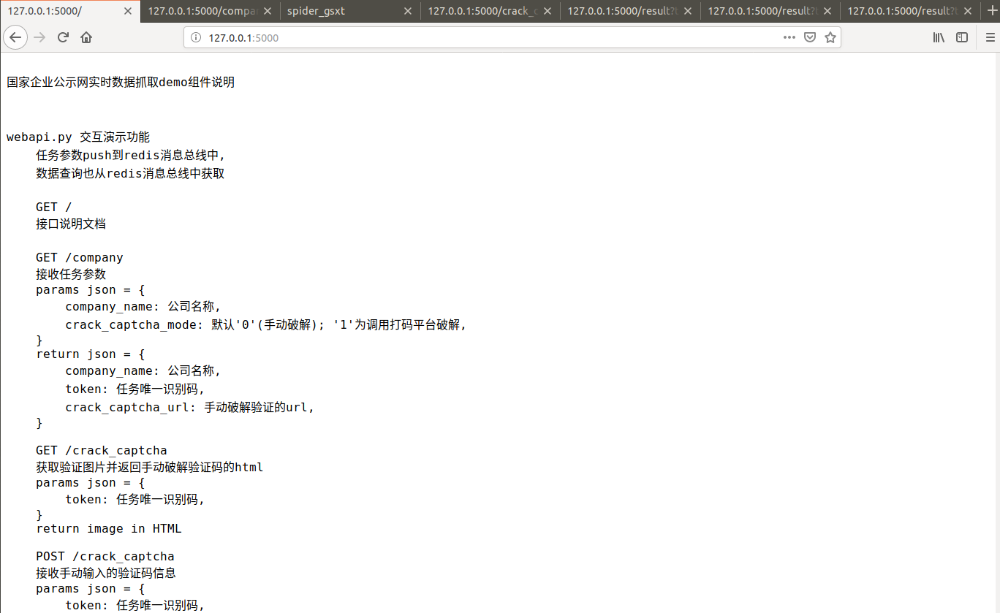
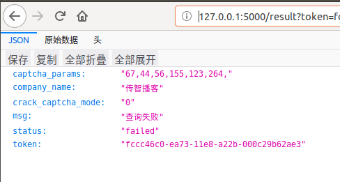

## 运行效果
##### 学习目标：
无

_________________

### 0. 首页--接口/说明文档

### 1. 启动爬虫

> 127.0.0.1:5000/company?company_name=

### 2. 访问手动打码页面

> 127.0.0.1:5000/crack_captcha?token= 

### 3. 打码后返回页

### 4. 查询结果

> 127.0.0.1:5000/result?token=

#### 4.1 抓取中

#### 4.2 抓取成功

#### 4.3 抓取失败

### 5. 静态文件夹

- error：保存异常页和截图
- html：保存数据页
- images：保存打码图片

_________________

## 小结
无